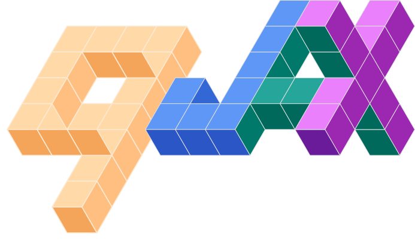

<div align="center">



#

**Tsallis statistics for artificial intelligence, built on [JAX](https://github.com/jax-ml/jax).**

[](https://pypi.org/project/qjax/)
[](https://www.python.org/)
[](LICENSE)
[](https://github.com/jax-ml/jax)
[](https://github.com/astral-sh/ruff)

[Quickstart](#quickstart) • [Building blocks](#building-blocks) • [Example](#label-noise-robustness) • [Installation](#installation)

</div>

## What is qjax?

Tsallis (non-extensive) statistics generalizes Boltzmann–Gibbs–Shannon statistics through a single *entropic index* $q$. As $q \to 1$ every construction collapses back to its classical counterpart — Shannon entropy, the Gaussian, softmax, the Kullback–Leibler divergence — while $q \neq 1$ opens up heavy tails, sparse attention, and tunable exploration.

`qjax` exposes these $q$-deformed primitives as **pure, differentiable, `jit`/`vmap`-friendly** JAX functions. Because $q$ is just another argument, you can hold it fixed *or* **learn it end-to-end by gradient descent**.

Every primitive is a single closed form in the entropic index $q$, and each recovers its Boltzmann–Gibbs–Shannon counterpart in the $q \to 1$ limit:

| `qjax` | Definition | Limit $q \to 1$ |
| --- | --- | --- |
| `q_log` | $\ln_q x = \dfrac{x^{1-q} - 1}{1 - q}$ | $\ln x$ |
| `q_exp` | $\exp_q x = \big[1 + (1-q)\,x\big]_+^{\frac{1}{1-q}}$ | $e^{x}$ |
| `tsallis_entropy` | $S_q(p) = \dfrac{1 - \sum_i p_i^{\,q}}{q - 1}$ | $-\sum_i p_i \ln p_i$ |
| `tsallis_cross_entropy` | $H_q(y, p) = -\sum_i y_i \ln_q p_i$ | $-\sum_i y_i \ln p_i$ |
| `tsallis_divergence` | $D_q(p \,\Vert\, r) = \dfrac{\sum_i p_i^{\,q}\, r_i^{\,1-q} - 1}{q - 1}$ | $\mathrm{KL}(p \,\Vert\, r)$ |
| `q_gaussian_pdf` | $\mathcal{G}_q(x) = \dfrac{\sqrt{\beta}}{C_q}\,\exp_q(-\beta x^2)$ | $\sqrt{\tfrac{\beta}{\pi}}\,e^{-\beta x^2}$ |
| `tsallis_entmax` | $entmax_q(z) = \arg\max_{p \in \Delta}\,\langle p, z\rangle + S_q(p)$ | $softmax(z)$ |

where $[\,\cdot\,]_+ = \max(\cdot, 0)$ is the Tsallis cut-off, $C_q$ the $q$-Gaussian normalization, and $\Delta$ the probability simplex
(`tsallis_entmax` is exactly **sparsemax** at $q = 2$).

> `qjax` is a research library. The numerics are tested across the $q \to 1$
> limit, gradients, and `jit`/`vmap`, but the API may still evolve.

## Contents

- [Quickstart](#quickstart)
- [Building blocks](#building-blocks)
- [A learnable `q`](#a-learnable-q)
- [Label-noise robustness](#label-noise-robustness)
- [Installation](#installation)
- [Documentation](#documentation)
- [Development](#development)
- [Contributing](#contributing)
- [Citing](#citing)
- [License](#license)

## Quickstart

```python
import jax, jax.numpy as jnp
import qjax

# q-deformed functions (recover log / exp as q -> 1)
qjax.q_log(2.0, q=1.5)
qjax.q_exp(1.0, q=1.5)

# Tsallis information measures
p = jnp.array([0.5, 0.3, 0.2])
qjax.tsallis_entropy(p, q=2.0)         # -> Shannon entropy as q -> 1
qjax.tsallis_divergence(p, p, q=2.0)   # -> KL divergence as q -> 1

# q-Gaussian distribution (heavy-tailed for 1 < q < 3)
x = jnp.linspace(-4, 4, 100)
qjax.q_gaussian_pdf(x, q=1.5, beta=1.0)
samples = qjax.sample(jax.random.PRNGKey(0), q=1.5, beta=1.0, shape=(1000,))

# Sparse softmax: q=1 -> softmax, q=2 -> sparsemax (exact zeros)
qjax.tsallis_entmax(jnp.array([2.0, 1.0, -1.0]), q=2.0)
```

## Building blocks

`qjax` is organized as a small set of composable, fully differentiable primitives. Each is a pure function of $(x, q)$.

### Deformed functions and $q$-algebra

`q_log` and `q_exp` are inverse deformations of `log`/`exp`; the accompanying $q$-algebra turns them into homomorphisms (`q_log(a·b) = q_add(q_log a, q_log b)`).

```python
qjax.q_log(x, q=1.5)                                   # (x**(1-q) - 1) / (1-q)
qjax.q_add(qjax.q_log(2.0, 1.4), qjax.q_log(3.0, 1.4), 1.4)   # == q_log(6.0, 1.4)
```

### Information measures

```python
p = jnp.array([0.5, 0.3, 0.2])
r = jnp.array([0.25, 0.25, 0.5])

qjax.tsallis_entropy(p, q=2.0)           # -> Shannon entropy as q -> 1
qjax.tsallis_cross_entropy(p, r, q=2.0)  # q-deformed cross-entropy loss
qjax.tsallis_divergence(p, r, q=2.0)     # -> KL(p || r) as q -> 1
```

### The $q$-Gaussian

A maximum-Tsallis-entropy distribution: heavy-tailed (Student-$t$) for $1 < q < 3$, compactly supported for $q < 1$, Gaussian at $q = 1$.

```python
x = jnp.linspace(-4, 4, 100)
qjax.q_gaussian_pdf(x, q=1.5, beta=1.0)
qjax.q_gaussian_logpdf(x, q=1.5, beta=1.0)
qjax.sample(jax.random.PRNGKey(0), q=1.5, beta=1.0, shape=(1000,))
```

### Sparse activations

`tsallis_entmax` interpolates between dense softmax ($q = 1$) and sparsemax
($q = 2$), producing exact zeros for $q > 1$ — a drop-in for sparse attention.

```python
z = jnp.array([2.0, 1.0, 0.1, -1.0])
qjax.tsallis_entmax(z, q=1.0)   # softmax (dense)
qjax.tsallis_entmax(z, q=2.0)   # sparsemax (exact zeros)
```

## A learnable $q$

Because $q$ is an ordinary differentiable argument, it is finite everywhere — including the $q = 1$ limit — so it can be optimized like any other parameter:

```python
import jax

x = jnp.linspace(-3, 3, 200)
nll = lambda q: -jnp.mean(qjax.q_gaussian_logpdf(x, q, 1.0))
grad_q = jax.grad(nll)(1.5)     # well-defined gradient w.r.t. the entropic index
```

This is what makes $q$ more than a hyperparameter: the right amount of non-extensivity can be *discovered* from data.

## Label-noise robustness

When training labels are noisy, ordinary softmax **cross-entropy** is unbounded — a confidently mislabeled example incurs an arbitrarily large loss, so an over-parameterized network ends up *memorizing* the noise. Replacing the logarithm with the deformed $q$-logarithm gives the **Tsallis cross-entropy**, which is *bounded* for $q < 1$: its gradient saturates on unfittable points, so the model ignores label noise instead of fitting it.

For a one-hot target with true class $c$ and softmax probabilities $p$,

$$\mathcal{L}_q(p, c) = -\ln_q p_c = \frac{1 - p_c^{\,1-q}}{1 - q}, \qquad \ln_q x = \frac{x^{1-q} - 1}{1 - q}.$$

As $q \to 1$ this is exactly the standard cross-entropy $-\log p_c$; for $q < 1$ the per-example loss is bounded above by $1/(1-q)$, so mislabeled points cannot dominate the gradient.

The figure trains a small 3-class classifier on two shapes (blobs, spiral) from clean data up to 40% label noise, comparing the Boltzmann–Gibbs–Shannon baseline ($q = 1$) with Tsallis ($q = 0.3$). The comparison is fair — both share the same initialization, data, noisy labels and optimizer; only $q$ differs. Without noise the two match (≈98–99%); as noise grows the baseline carves spurious wrong-class islands while Tsallis keeps clean regions and higher accuracy.


See the [classification example](docs/examples/classification.md) for the full setup.

## Installation

`qjax` requires Python 3.10+ and depends only on `jax` and `matplotlib`. It is managed with [uv](https://docs.astral.sh/uv/).

| Use case            | Command                                              |
| ------------------- | ---------------------------------------------------- |
| As a dependency     | `uv add qjax`                                        |
| Development         | `uv sync --extra dev`    (tests + linter)            |
| Building the docs   | `uv sync --extra docs`   (Sphinx + Furo)             |

For GPU/TPU acceleration, install the matching JAX build by following the [JAX installation guide](https://docs.jax.dev/en/latest/installation.html).

## Contributing

Contributions are welcome — new $q$-deformed primitives, examples, docs, and fixes. See [CONTRIBUTING.md](CONTRIBUTING.md) for the development setup, design principles (purity, the $q \to 1$ limit, finite gradients), and the checks CI runs.

## License

Released under the [MIT License](LICENSE).
