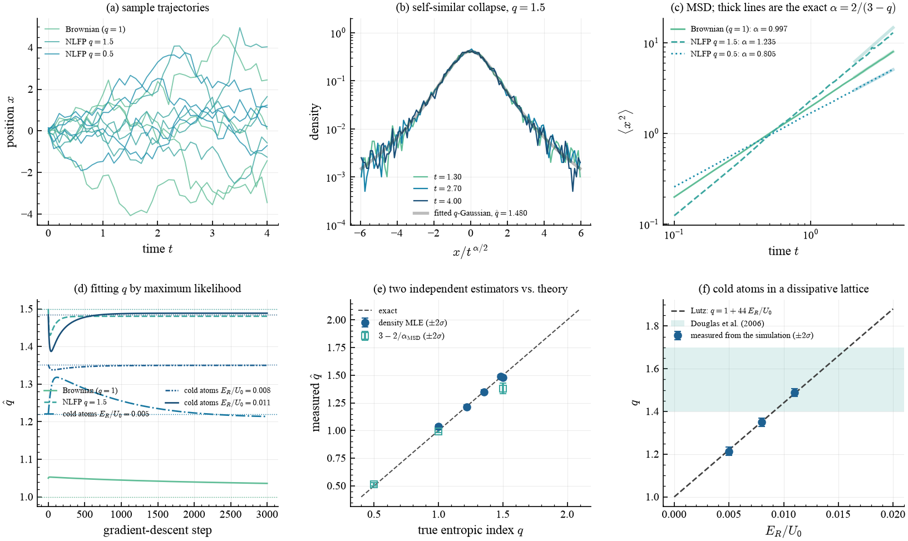

# Anomalous diffusion

> Here $q$ is neither chosen nor learned — it is **measured**, from trajectories,
> with a value predicted in advance and two independent estimators that can
> disagree.

## What it shows

Nonextensive statistics makes a falsifiable prediction about anomalous diffusion.
The nonlinear (porous-medium) Fokker–Planck equation

$$\frac{\partial p}{\partial t} = D\,\frac{\partial^2 p^{\,2-q}}{\partial x^2}$$

has the self-similar $q$-Gaussian solution of Tsallis & Bukman (1996), whose width
obeys $\langle x^2\rangle \propto t^{\alpha}$ with

$$\alpha = \frac{2}{3-q}.$$

So the *shape* of the distribution and the *growth* of its width are not two free
parameters: either one predicts the other. Fitting $q$ to the density and reading
it off the mean-squared displacement are therefore independent measurements of the
same number.

A second, experimentally realized mechanism gives the same distribution from a
**linear**-noise Langevin equation with saturating (Sisyphus) friction,

$$dp = -\frac{\alpha\,p}{1 + (p/p_c)^2}\,dt + \sqrt{2D_0}\,dW,$$

whose exact stationary solution is a $q$-Gaussian with

$$q = 1 + \frac{2D_0}{\alpha\,p_c^2}, \qquad \beta = \frac{\alpha}{2D_0}.$$

The heavy tail comes entirely from the friction *saturating*, so a fast atom is
barely damped — the noise stays ordinary and Gaussian. Because the three
coefficients are ours to choose, the true $q$ is known to machine precision.
Separately, Lutz (2003) evaluated those coefficients semiclassically for atoms in a
dissipative optical lattice and obtained $q = 1 + 44\,E_R/U_0$, confirmed
experimentally by Douglas, Bergamini & Renzoni (2006). The two are kept distinct:
the first is exact for *our simulation*, the second is a prediction about a *real
experiment*.

## How it works

The fit is the idiom of [fitting $q$ by maximum likelihood](learnable_q.md), with
an error bar added, because the comparison against theory has to be quantitative:

```python
import qjax
from qjax.nn import bounded_q

def negative_log_likelihood(raw):
    q, beta = bounded_q(raw[0], 1.0, 2.9), jax.nn.softplus(raw[1]) + 1e-3
    return -jnp.mean(qjax.q_gaussian_logpdf(samples, q, beta))

# ... gradient descent, then the asymptotic Fisher covariance at the optimum:
covariance = jnp.linalg.inv(jax.hessian(negative_log_likelihood)(raw)) / n
sensitivity = jax.jacfwd(lambda r: bounded_q(r[0], 1.0, 2.9))(raw)
q_sigma = jnp.sqrt(sensitivity @ covariance @ sensitivity)
```

`qjax.sample` also supplies the *initial condition* for its own equation: starting
the superdiffusive run on the exact self-similar $q$-Gaussian profile makes the
mean-squared displacement a pure power law from the first step, which moves the
fitted exponent from 1.246 to 1.324 against the exact $4/3$.

### Two constraints, stated rather than hidden

- For $q < 1$ the $q$-Gaussian has **compact support**, so
  `q_gaussian_logpdf` is $-\infty$ outside it and the likelihood is $+\infty$:
  a gradient-based fit started at $q > 1$ can never cross into $q < 1$. The
  subdiffusive arm's index is therefore measured through $q = 3 - 2/\alpha$
  instead. That is a real property of compact-support likelihoods.
- `bounded_q` maps onto an *open* interval, so $q = 1$ is approached and never
  attained. For genuinely Boltzmann–Gibbs data the fit lands a little above the
  boundary ($\approx 1.04$ at the default step count), so the control's $\hat q$
  reads as an **upper bound**, not an unbiased estimate.

## Result

<figure markdown>
  
  <figcaption markdown>
  (a) Sample trajectories: sub-, normal and superdiffusive are visibly different. (b) The self-similar collapse — densities at three times, rescaled by $t^{\alpha/2}$, falling onto one curve, with the arm's own fitted $q$-Gaussian transported into the rescaled coordinate. (c) Mean-squared displacement with the exact $\alpha = 2/(3-q)$ reference slopes overlaid. (d) The maximum-likelihood run for each arm, with theory dashed. (e) **The money panel**: two independent estimators against the known $q$, on the identity line. (f) The cold-atom arms against Lutz's law and the range reported by Douglas et al.
  </figcaption>
</figure>

## Validation

Laptop tier (20 000 particles), against exact values:

| arm | true $q$ | $\hat q$ from the density | $\hat q$ from the MSD | $\alpha$ measured / exact |
| --- | --- | --- | --- | --- |
| Brownian control | 1.0000 | 1.036 ± 0.009 (upper bound) | 0.994 ± 0.006 | 0.9971 / 1.0000 |
| NLFP $q=1.5$ | 1.5000 | **1.4804 ± 0.0090** | 1.381 ± 0.024 | 1.235 / 1.3333 |
| NLFP $q=0.5$ | 0.5000 | n/a (compact support) | **0.5142 ± 0.0074** | 0.8046 / 0.8000 |
| cold atoms, $E_R/U_0 = 0.005$ | 1.2200 | **1.2138 ± 0.0103** | n/a (stationary) | n/a |
| cold atoms, $E_R/U_0 = 0.008$ | 1.3520 | **1.3499 ± 0.0097** | n/a (stationary) | n/a |
| cold atoms, $E_R/U_0 = 0.011$ | 1.4840 | **1.4886 ± 0.0090** | n/a (stationary) | n/a |

All three cold-atom indices land **within one sigma** of the exact stationary
value, which is simultaneously Lutz's prediction for that lattice depth. The
Brownian control returns $\alpha = 1.00$ to $0.3\,\%$, and the subdiffusive arm's
scaling-relation estimate is within $2\sigma$ of the exact $q = 0.5$.

Having two independent estimators means they can disagree, and on the
superdiffusive arm they do: the density likelihood gives $1.480 \pm 0.009$
($2.2\sigma$ from $1.5$) while the mean-squared-displacement exponent gives
$\alpha = 1.235$ against the exact $4/3$ — about $7\,\%$ low. The distribution
reaches its self-similar *shape* long before the width reaches its asymptotic
*slope*, so within the simulated window the MSD route is the slower of the two to
converge. Reporting both is the point; a single fitted exponent would have looked
like agreement.

The mean-squared-displacement route is deliberately marked n/a for the cold-atom
arms: they relax to a *stationary* momentum distribution, so the second moment
saturates instead of growing and $\alpha = 2/(3-q)$ does not apply. That is also
true of the real experiment, where the velocity distribution is the observable.

## Equilibration is the hard part

The cold-atom arms are run for a matched number of friction relaxation times
rather than a matched number of steps, because the friction differs fourfold
across them. It matters, and the reason is physical: past $q = 5/3$ the
$q$-Gaussian's second moment diverges and the *tail* of the stationary state
equilibrates as a power law rather than exponentially. At $q = 1.75$ the measured
index is still 3 % low after 150 relaxation times and creeping upward; the arms
here stay below $5/3$ so that the error bars mean what they say.

## Takeaways

- $q$ can be a measured physical quantity with an error bar, not a hyperparameter.
- Two independent estimators — the density likelihood and the MSD exponent — agree
  with an exactly known $q$, and the relation $\alpha = 2/(3-q)$ ties them.
- Heavy tails need not come from heavy-tailed noise: saturating friction with
  ordinary Gaussian noise produces an exact $q$-Gaussian.
- The compact support of the $q<1$ $q$-Gaussian is a real obstacle to
  likelihood-based inference, and the scaling relation is the way around it.
  It is not an obstacle to a *PDE residual*, which is well defined there.

## References

- A. R. Plastino & A. Plastino, *Non-extensive statistical mechanics and
  generalized Fokker-Planck equation*, Physica A **222**, 347 (1995).
- C. Tsallis & D. J. Bukman, *Anomalous diffusion in the presence of external
  forces*, Phys. Rev. E **54**, R2197 (1996).
- E. Lutz, *Anomalous diffusion and Tsallis statistics in an optical lattice*,
  Phys. Rev. A **67**, 051402(R) (2003).
- P. Douglas, S. Bergamini & F. Renzoni, *Tunable Tsallis distributions in
  dissipative optical lattices*, Phys. Rev. Lett. **96**, 110601 (2006).
