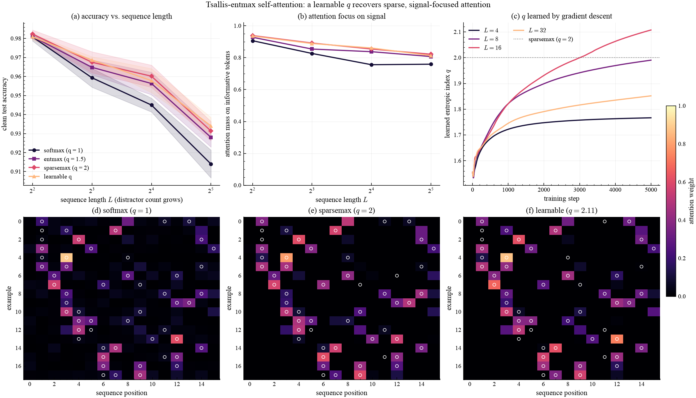

# Sparse self-attention

> A single-head attention-pooling classifier with `tsallis_entmax` attention;
> a *learnable* `q` recovers sparse, signal-focused attention as distractors grow.

## What it shows

Each length-$L$ sequence contains $K$ informative tokens (carrying the class
prototype plus a shared "signal" direction) and $L - K$ pure-noise distractors. A
single-head attention-pooling classifier must locate the informative tokens and
pool their evidence. The one knob is the entropic index `q` of the attention map,
which replaces the usual softmax with `tsallis_entmax` over the score axis:

$$
a = \operatorname{entmax}_q(s), \qquad
a_j = \big[(q-1)\,s_j - \tau\big]_+^{1/(q-1)} .
$$

At $q = 1$ this is ordinary **softmax** attention (dense): every position —
including pure-noise distractors — receives a non-zero weight, so as $L$ grows the
pooled representation is diluted by noise. For $q > 1$ it becomes **entmax /
sparsemax** attention, assigning irrelevant positions *exactly* zero weight.
Making `q` **learnable** lets gradient descent discover the attention sparsity
that best fits the task.

## How it works

The attention map is a drop-in replacement for `softmax` — `tsallis_entmax` over
the score axis:

```python
import jax.numpy as jnp
import qjax

scores = keys @ params["query"] / jnp.sqrt(D_MODEL)        # (n, L)
attn = qjax.tsallis_entmax(scores, q=q, axis=-1, num_iters=25)
context = jnp.einsum("nl,nld->nd", attn, values)           # pooled representation
logits = context @ params["w_out"] + params["b_out"]
```

With `q = 1` this is exactly softmax attention; with a learnable `q` the same
code trains the sparsity end-to-end.

## Result

<figure markdown>
  
  <figcaption markdown>
  (a) Clean accuracy vs. sequence length (distractor count grows). (b) Fraction of attention mass placed on informative tokens. (c) The learned `q` over training, converging near sparsemax. (d–f) Attention maps (examples × positions) for softmax, sparsemax, and the learnable `q` — white outlines mark the ground-truth informative tokens; sparse attention zeroes out the noise.
  </figcaption>
</figure>

## Takeaways

`qjax.tsallis_entmax` is a one-line, differentiable replacement for the
softmax in attention, with `q` controlling sparsity. Sparse attention ($q > 1$)
ignores distractor tokens, so accuracy holds up as the sequences grow, and a
**learnable `q`** converges near sparsemax ($q \approx 2$) on its own — the same
learnable-`q` story as in [classification](classification.md) and
[reinforcement learning](reinforcement_learning.md).
