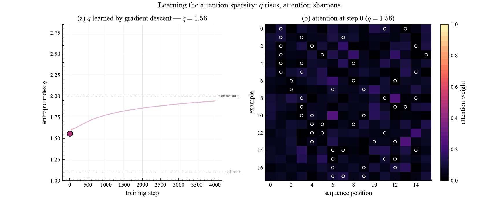

# Learning `q` in attention

> Watch the entropic index `q` being learned *inside* an attention mechanism: as
> `q` rises toward sparsemax, the attention map sharpens onto the informative
> tokens.

This is the dynamic companion to [sparse self-attention](attention_mlp.md). The
same single-head attention-pooling classifier is trained, but here we animate the
optimization so the **learning** of `q` is visible frame by frame.

## What it shows

A sequence has a few **informative** tokens (carrying a shared signal marker plus
the class) among many **noise** distractors. The attention map is
`tsallis_entmax(scores, q)`, and `q` is a trained parameter:

```python
def learned_q(params):
    # q is constrained to (1.1, 2.8) so it stays in the sparse-entmax regime
    return bounded_q(params["q_raw"], Q_MIN, Q_MAX)

def forward(params, x, q):
    scores = (x @ params["w_key"]) @ params["query"] / jnp.sqrt(D_MODEL)
    attn = qjax.tsallis_entmax(scores, q=q, axis=-1)   # q flows gradients
    ...
```

`q` is updated by the *same* Adam step as every other weight — the entropic index
is just another differentiable parameter.

## Result

<figure markdown>
  
  <figcaption markdown>
  **Left:** the learned `q` over training, climbing from its initialization (`q ≈ 1.56`) toward sparsemax (`q = 2`). **Right:** the attention map (examples × positions) recomputed at each step — white outlines mark the ground-truth informative tokens. Early on, attention is diffuse; as `q` is learned the map sharpens and concentrates exactly on the outlined tokens, zeroing out the noise.
  </figcaption>
</figure>

## Takeaways

- `q` is **learned end-to-end** by gradient descent, not tuned — it converges near
  sparsemax (`q ≈ 1.9`) because that best solves the signal-in-distractors task.
- Attention **sparsity and learning happen together**: the rising `q` and the
  sharpening attention map are two views of the same optimization.
- For the fixed-`q` comparison (softmax vs entmax vs sparsemax) across sequence
  lengths, see [sparse self-attention](attention_mlp.md).
