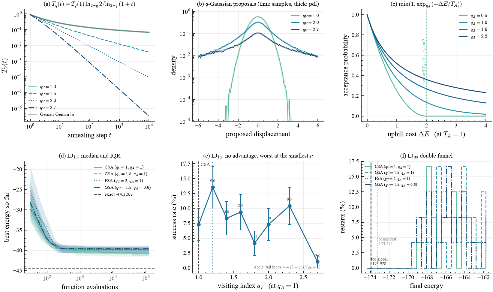
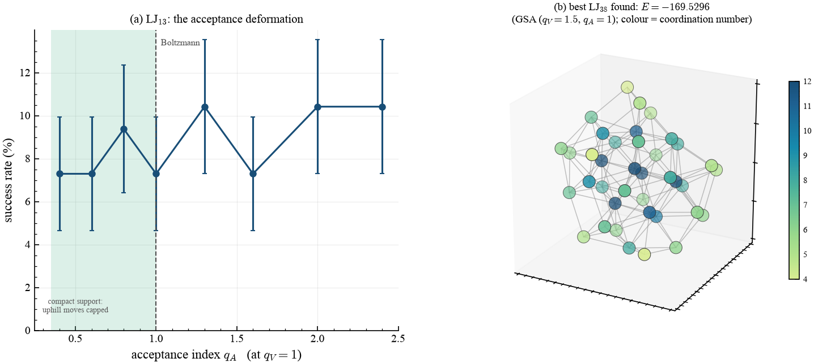

# Generalized simulated annealing

> Tsallis & Stariolo's algorithm is two `qjax` calls, and its cooling schedule is
> a ratio of two `q_log` calls whose $q\to1$ limit is exact. What the benchmark
> then measures is a **negative result with a mechanism** — and it is reported as
> one.

## What it shows

Generalized simulated annealing (Tsallis & Stariolo, *Physica A* **233**, 395,
1996 — this journal's own lineage) replaces the two Boltzmann ingredients of
classical annealing by their $q$-deformed counterparts:

| ingredient | classical | generalized | in `qjax` |
| --- | --- | --- | --- |
| proposal | Gaussian | $q$-Gaussian, tails $\sim|x|^{-2/(q_V-1)}$ | `qjax.sample(key, q=q_V, beta=1/sigma**2, ...)` |
| acceptance | $e^{-\Delta E/T_A}$ | $\exp_{q_A}(-\Delta E/T_A)$ | `qjax.q_exp(-delta / t_a, q_a)` |
| schedule | Geman–Geman $\ln$ | the Tsallis law below | `qjax.physics.visiting_temperature` |

Setting $q_V = q_A = 1$ recovers Kirkpatrick's Boltzmann machine *exactly*, and
$q_V = 2$ is Szu & Hartley's Cauchy machine, so the $q = 1$ arm is a genuine
baseline rather than a strawman.

### The schedule is where the library earns its place

The Tsallis cooling law

$$T_q(t) = T_q(1)\,\frac{2^{q-1}-1}{(1+t)^{q-1}-1}$$

is $0/0$ at $q = 1$ — the same pathology `qjax.shared.series` exists to defeat.
Substituting $x^{q-1} - 1 = (q-1)\ln_{2-q}x$ cancels both $(q-1)$ factors and
leaves a **ratio of two `q_log` calls**:

```python
def tsallis_schedule(step, initial, q):
    return initial * qjax.q_log(2.0, 2.0 - q) / qjax.q_log(1.0 + step, 2.0 - q)
```

At $q = 1$ this returns the Geman–Geman logarithmic schedule
$T(1)\ln 2/\ln(1+t)$ to **zero error**, with no branch on $q$ and — because
`q_log` carries the limit through the entire function $(e^t-1)/t$ rather than
switching to a $q$-independent formula — with a correct, non-zero derivative in
$q$. The test suite pins the limit to $10^{-12}$ and checks
$\partial T/\partial q$ at $q=1$ against its analytic value
$(\ln 2/\ln(1+t))(\ln 2 - \ln(1+t))/2$. A learnable cooling index is therefore
just another parameter.

## How it works

```python
import qjax.physics as qp

visiting = qp.visiting_temperature(step, INITIAL_VISITING, q_visit)
accepting = qp.acceptance_temperature(step, INITIAL_ACCEPTANCE, q_accept)

# Tsallis & Stariolo tie the width to T_V^{1/(3-q_V)}, not to T_V.
width = visiting ** (1.0 / (3.0 - q_visit))
jump = direction * jnp.abs(qjax.sample(key, q=q_visit, beta=1.0 / width**2, shape=()))

probability = jnp.minimum(qjax.q_exp(-(new - old) / accepting, q_accept), 1.0)
```

Two implementation details are measured rather than assumed:

- The proposal must be **isotropic** — one unit direction in the full $3n$-
  dimensional configuration space times one radial draw. Drawing the $3n$
  coordinates independently looks equivalent and is not: at $q_V = 2.7$ each
  coordinate exceeds 100 width units with probability $\approx 0.09$, so across 39
  coordinates *something* blows up on essentially every step, and LJ13 loses more
  than half its depth.
- The walk is confined to a ball, and the proposal is capped at its diameter. That
  cap is exact (a longer displacement is projected to the same place) and it is
  necessary: `qjax.sample` builds the Student-$t$ from a $\chi^2_\nu$ variate, and
  in float32 a shape-0.09 gamma draw underflows to exactly zero often enough
  (about 1 in 2000 at $q_V = 2.7$) that the division returns `+inf`.

## Result

<figure markdown>
  
  <figcaption markdown>
  (a) The Tsallis schedule for several $q_V$, with the Geman–Geman logarithmic curve underneath the $q_V=1$ case — they coincide exactly. (b) $q$-Gaussian proposals: sampled histograms (thin) on the analytic density (thick), validating `qjax.sample` and showing the Lévy-like tails. (c) The acceptance rule, with the $q_A<1$ cut-off at $\Delta E = T_A/(1-q_A)$ marked — that cut-off is physics, not underflow. (d) LJ13 best-so-far energy against function evaluations, median and interquartile range. (e) The visiting-index scan, labelled with the tail index $\nu$. (f) LJ38: where each arm ends up, relative to *both* funnel minima.
  </figcaption>
</figure>

<figure markdown>
  
  <figcaption markdown>
  (a) The companion scan over the *acceptance* index at $q_V = 1$, isolating the second deformation. The shaded region is the compact-support side, where an uphill move beyond $T_A/(1-q_A)$ is rejected outright. (b) The best LJ38 cluster found, bonded within $1.35\,\sigma$ and coloured by coordination number.
  </figcaption>
</figure>

Both scans are 1-D on purpose. A $(q_V, q_A)$ grid is the tempting figure and the
wrong one: at any trial count this script can afford, a single cell carries a
binomial error of order 12 percentage points — larger than any effect being looked
for — so it renders as a blocky pattern that invites over-reading. Scanning each
index separately at six times the restarts gives error bars small enough to mean
something.

## Validation

| quantity | measured | reference | source |
| --- | --- | --- | --- |
| LJ2 (regular simplex at $2^{1/6}\sigma$) | −1.000000000 | −1 | closed form |
| LJ3 | −3.000000000 | −3 | closed form |
| LJ4 | −6.000000000 | −6 | closed form |
| LJ7 best found | −16.505390 | −16.505384 | Cambridge Cluster Database |
| LJ13 best found | −44.326805 | −44.326801 | " |
| LJ38 best found | ≈ −169.5 | −173.928427 | " (budget insufficient — see below) |
| $T_q(t)$ at $q=1$ vs Geman–Geman | 0 error | — | closed form |
| $\partial T_q/\partial q$ at $q=1$ | matches to $10^{-6}$ | — | closed form |

The three closed forms are exact to $10^{-12}$, and both LJ7 and LJ13 global
minima are recovered to better than $10^{-4}$ — including the sign check that
matters: **no arm ever reports an energy below its tabulated reference**, which a
buggy potential or an active confining wall would produce immediately.

## The measured result

Success rates within $10^{-2}$ of the reference, laptop tier:

| system | CSA ($q_V=1$) | GSA ($q_V=1.5$) | FSA ($q_V=2$) | GSA ($q_V=1.5$, $q_A=0.6$) |
| --- | --- | --- | --- | --- |
| LJ7 (32 restarts) | 31.2 ± 8.2 % | 28.1 ± 7.9 % | 34.4 ± 8.4 % | 21.9 ± 7.3 % |
| LJ13 (64 restarts) | **17.2 ± 4.7 %** | 12.5 ± 4.1 % | 4.7 ± 2.6 % | 9.4 ± 3.6 % |

Deforming the visiting distribution does not accelerate global optimization here.
On LJ13 the classical Gaussian proposal has the highest success rate of the four
arms and the Cauchy machine is the lowest, $2.3\sigma$ apart; LJ7 is flat within
its error bars.

The two scans, at 96 restarts each, say the same thing more sharply. They use a
smaller per-restart budget than the four arms above (2500 steps against 4000), so
their absolute rates are lower and the two sets should not be compared directly —
only within themselves.

| scan | at the classical point | best in the scan | worst in the scan |
| --- | --- | --- | --- |
| visiting $q_V$ (at $q_A=1$) | 7.3 ± 2.7 % | 13.5 ± 3.5 % at $q_V=1.2$ ($\nu=9$) | **1.0 ± 1.0 % at $q_V=2.7$ ($\nu=0.18$)** |
| acceptance $q_A$ (at $q_V=1$) | 7.3 ± 2.7 % | 8.0 % mean over $q_A<1$ | 9.6 % mean over $q_A>1$ |

Read together: the visiting index is flat within error for $q_V \lesssim 2$, and
$q_V = 2.7$ is worse than every other point by more than $2\sigma$. The
*acceptance* index does essentially nothing — the compact-support and heavy-tailed
sides differ from Boltzmann by less than one standard error. So of the two
deformations that generalized annealing introduces, one is inert here and the other
only hurts, once its tail index gets small enough. There is no interior optimum to
report.

The reason is not the width — the Tsallis–Stariolo coupling
$\sigma = T_V^{1/(3-q_V)}$ is used, and its exponent already shrinks the width
faster at large $q_V$ — but the **tail index**

$$\nu = \frac{3-q_V}{q_V-1},$$

which sets how often a proposal is catastrophic: a displacement exceeds $k$ width
units with probability $\sim k^{-\nu}$. At $q_V = 2.7$, $\nu = 0.18$, and a
*majority* of proposals then exceed the container diameter however small the width
is (measured, and asserted in the test suite), so the cluster is scattered at
every step and the cooling schedule never gets to act.

### What this is and is not

This is a statement about *this* parameterization, not a refutation of
Tsallis & Stariolo. Three things differ from their setup, and any of them could
matter: the proposal is an isotropic radial $q$-Gaussian rather than their exact
$D$-dimensional visiting distribution, the local minimizer is Adam rather than a
quasi-Newton method, and the cluster is confined to a ball. What the example does
establish is that the entropic index is not a free win on this landscape, and that
$\nu$ — not $q_V$ — is the quantity to reason about when choosing it.

### LJ38 is not solved, deliberately

LJ38's global minimum is an fcc truncated octahedron, *not* icosahedral, and the
much wider icosahedral basin at $-173.252378$ is only 0.38 % higher in energy.
Nothing in a budget of $10^4$–$10^5$ evaluations reliably finds it; at the laptop
tier no arm even reaches the icosahedral funnel. The panel is therefore framed as
a funnel-escape distribution against *both* minima, and the rates are reported as
measured. Promising otherwise would be the easiest place in this whole set of
examples to mislead.

## Takeaways

- GSA is two `qjax` calls; its schedule's $q\to1$ limit is exact and
  differentiable through `q_log`, with no branch.
- The LJ potential and the two smaller global minima validate to machine
  precision, so the negative result rests on a verified implementation.
- The visiting index is not a free win: on LJ clusters the classical proposal is at
  least as good, and performance degrades as the tail index $\nu$ falls.
- Reason about $\nu$, not $q_V$: it is the parameter with operational meaning, and
  it changes by a factor of 50 across $q_V \in [1.2, 2.7]$.

## References

- C. Tsallis & D. A. Stariolo, *Generalized simulated annealing*,
  Physica A **233**, 395 (1996).
- H. Szu & R. Hartley, *Fast simulated annealing*, Phys. Lett. A **122**, 157 (1987).
- S. Geman & D. Geman, IEEE Trans. Pattern Anal. Mach. Intell. **6**, 721 (1984).
- D. J. Wales & J. P. K. Doye, *Global optimization by basin-hopping*,
  J. Phys. Chem. A **101**, 5111 (1997); and the
  [Cambridge Cluster Database](https://www-wales.ch.cam.ac.uk/CCD.html).
- J. P. K. Doye, M. A. Miller & D. J. Wales, *The double-funnel energy landscape of
  the 38-atom Lennard-Jones cluster*, J. Chem. Phys. **110**, 6896 (1999).
