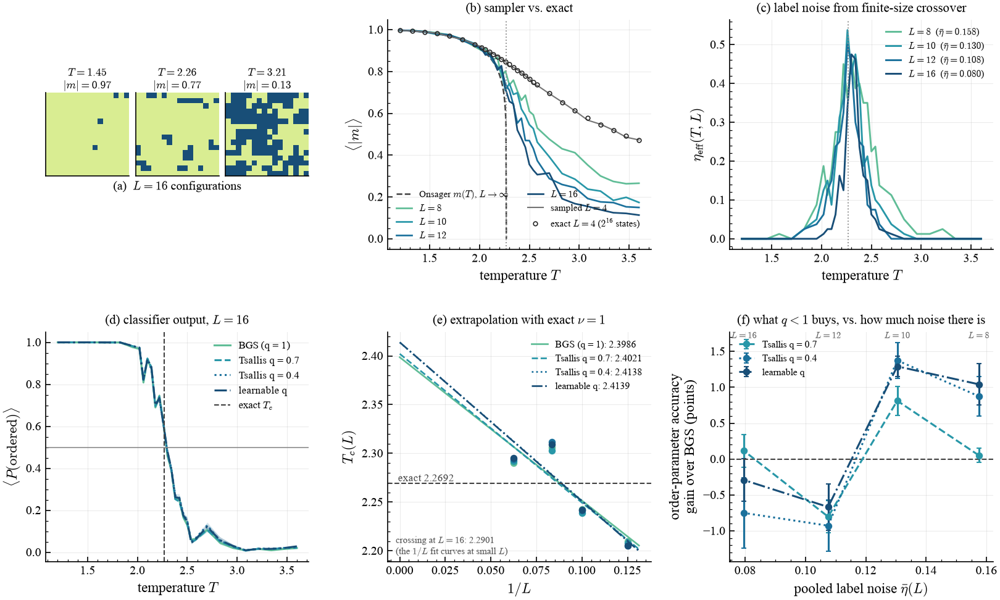
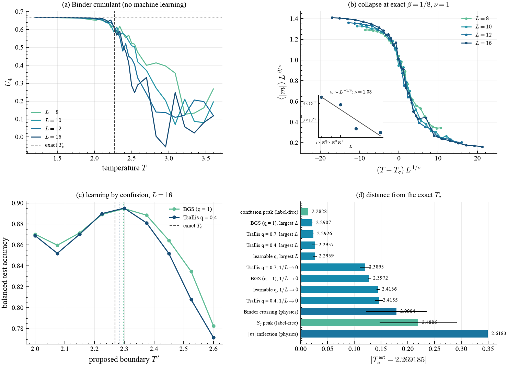

# Ising phases and $T_c$

> Machine learning the 2-D Ising transition, where the label noise is generated by
> the physics of finite-size crossover rather than injected by hand — so it can be
> *measured*, and so the bounded Tsallis loss has a physical knob.

## What it shows

Classifying Monte Carlo spin configurations as ordered or disordered and reading
the critical temperature off the classifier is the standard machine-learning
approach to phases of matter (Carrasquilla & Melko, 2017). The `q = 1` arm here
*is* that method: an MLP trained with ordinary cross-entropy.

What makes it a Tsallis problem is where the labels come from. They are assigned
by temperature, $y = \mathbb 1[T < T_c]$, but near the transition the correlation
length $\xi \sim |T - T_c|^{-1}$ exceeds the lattice, so a configuration drawn
just *above* $T_c$ is genuinely typical of the ordered phase. Its temperature
label is wrong — and this is **label noise generated by the physics**, not
injected as in [label-noise robustness](classification.md).

Being physical, it is measurable and it has a knob. The magnetization is the exact
order parameter, so a threshold on $|m|$ is the best any function of the
configuration can do; where it disagrees with the temperature label, the *label*
is what is wrong. That disagreement rate $\eta_{\rm eff}(T, L)$ is the measured
noise, and it shrinks as $L$ grows and the crossover narrows.

## How it works

The loss is `qjax.nn.tsallis_cross_entropy_loss` with `normalizer_q=1.0`, which
keeps an ordinary softmax under the deformed loss:

```python
from qjax.nn import bounded_q, tsallis_cross_entropy_loss
import qjax.physics as qp

configurations = qp.sample_ising(key, size=16, temperatures=grid,
                                 num_samples=80, sweeps=700)

def loss_fn(params, x, y_onehot):
    q = bounded_q(params["q_raw"], 0.3, 1.3)   # or a fixed q
    return tsallis_cross_entropy_loss(
        logits(params, x), y_onehot, q=q, from_logits=True, normalizer_q=1.0
    )
```

Passing `normalizer_q=1.0` is deliberate twice over: it avoids the 50-step
`tsallis_entmax` bisection in the inner loop, and it rules out the genuine
`+inf` that a sparse normalizer produces when it puts exactly zero mass on the
true class.

Both halves of the data are augmented with their global spin flip. That is not
data augmentation for its own sake: $-s$ has exactly the same energy as $s$, so
without it the network can key on $\operatorname{sign}(m)$, which carries no
phase information at all.

## Result

<figure markdown>
  
  <figcaption markdown>
  (a) $L=16$ configurations below, at, and above $T_c$. (b) Sampler validation: the sampled $L=4$ curve sits on the exhaustive enumeration of all $2^{16}$ states, and the larger lattices approach Onsager's $m(T)$. (c) The measured label noise $\eta_{\rm eff}(T,L)$, peaked at the transition and shrinking with $L$. (d) $\langle P(\text{ordered})\rangle$ per arm at $L=16$. (e) Finite-size extrapolation of the $\tfrac12$ crossing with the exact $\nu=1$; the points visibly curve at these sizes, which is why the largest-$L$ crossing is the better estimate. (f) The Tsallis result: the accuracy gain over the $q=1$ baseline against the pooled label noise.
  </figcaption>
</figure>

<figure markdown>
  
  <figcaption markdown>
  (a) The Binder cumulant, a physics baseline with no machine learning in it. (b) Finite-size-scaling collapse at the *exact* exponents $\beta = 1/8$, $\nu = 1$ — a strong check that the sampler is equilibrated; the inset recovers $\nu$ from the classifier's own crossover width. (c) Learning by confusion: the balanced accuracy peaks at the true $T_c$ with no knowledge of it anywhere in the pipeline. (d) Distance from the exact $T_c$ for every estimator.
  </figcaption>
</figure>

## Validation

Laptop tier (`L` up to 16, 4 seeds), against exact values:

| quantity | measured | exact | source of the exact value |
| --- | --- | --- | --- |
| $T_c$, best estimator (confusion peak, label-free) | 2.2828 | 2.269185 | Onsager (1944), closed form |
| $T_c$, best supervised arm ($q=1$, largest $L$) | 2.2907 ± 0.0011 | 2.269185 | " |
| $\nu$, from the crossover width $w(L)$ | 1.031 | 1 | exact 2-D exponent |
| $\beta$, from $\langle|m|\rangle(T_c)$ vs $L$ | 0.1288 | 0.125 | exact 2-D exponent |
| $u(T_c)/J$ at $L=16$ | −1.459 | −1.414214 | Onsager; the residual is finite-size |
| sampled $\langle|m|\rangle$, $u$ at $L=4$ | within 3σ | — | brute force over all $2^{16}$ states |
| $\log Z$ at $L=4$ | agree to $10^{-10}$ | — | enumeration vs. transfer matrix |

$T_c$ is recovered to **0.6 %** by a label-free estimator and $\nu$ and $\beta$ to
**3 %** each, from raw spin configurations.

Two things about the method are worth stating outright rather than leaving in the
source. First, the two **physics baselines** (the Binder crossing and the
susceptibility peak) are read inside a fixed window $T \in [2.00, 2.62]$, where
the temperature grid is dense. That window contains the exact $T_c$, so those two
estimators are told roughly where to look — the restriction *helps* them, since a
noisy Binder curve crosses many times far from $T_c$, which is why it is applied
to them and not to the learned estimators. The confusion scan and the classifier
crossings use the full grid. Second, equilibration was checked rather than
assumed: following one set of chains at $T_c$ well past the shipped budget shows
no residual drift in $u$ at any size up to $L = 64$, and `test_physics_lattice.py`
pins the sampled $u(T_c)$ at $L = 8$ against the transfer matrix, which is exact
for the finite periodic lattice.

## What $q$ buys, and where it stops

Scored against the order parameter rather than against the temperature labels
(the physical analogue of a clean test set), the result is a **threshold rather
than a smooth trend**:

| $L$ | pooled noise $\bar\eta$ | $q=1$ accuracy | $q=0.7$ | $q=0.4$ | learnable $q$ |
| --- | --- | --- | --- | --- | --- |
| 8 | 0.158 | 87.55 ± 0.43 | +0.05 ± 0.10 | **+0.87 ± 0.28** | **+1.04 ± 0.28** |
| 10 | 0.130 | 87.78 ± 0.15 | +0.81 ± 0.20 | **+1.38 ± 0.25** | **+1.29 ± 0.14** |
| 12 | 0.108 | 91.83 ± 0.03 | −0.80 ± 0.23 | −0.93 ± 0.35 | −0.67 ± 0.32 |
| 16 | 0.080 | 93.20 ± 0.12 | +0.11 ± 0.23 | −0.75 ± 0.49 | −0.29 ± 0.30 |

(gains in accuracy points over the $q=1$ arm, mean ± s.e. over 4 seeds)

Above roughly 13 % noise the bounded loss gains about a point, several standard
errors clear. Below roughly 11 % it costs about the same. So nonextensivity pays
here only above a measurable value of a physical parameter — and the sign change
is reported rather than smoothed over.

The learnable $q$ is the arm that survives the regime change: at or near the top
in the noisy regime, least penalized in the clean one. That is the practical
argument for treating $q$ as a parameter to be learned rather than a constant to
be chosen, in a setting where the right value depends on a physical scale the
modeller does not control.

## Takeaways

- The pipeline recovers $T_c$, $\nu$ and $\beta$ from raw configurations, each
  against an exact value — so every claim below it is anchored.
- Finite-size crossover is a *physical* source of label noise, measurable as
  $\eta_{\rm eff}(T, L)$ and tunable through $L$.
- The bounded Tsallis loss helps in proportion to that noise, with a threshold
  near $\bar\eta \approx 0.12$; a learnable $q$ tracks the regime.
- Two label-free estimators — the peak of `qjax.tsallis_entropy` on the network
  output, and learning by confusion — locate $T_c$ without ever being told it.

## References

- L. Onsager, *Crystal statistics I*, Phys. Rev. **65**, 117 (1944).
- J. Carrasquilla & R. G. Melko, *Machine learning phases of matter*,
  Nat. Phys. **13**, 431 (2017).
- E. P. L. van Nieuwenburg, Y.-H. Liu & S. D. Huber, *Learning phase transitions
  by confusion*, Nat. Phys. **13**, 435 (2017).
- Z. Zhang & M. R. Sabuncu, *Generalized cross entropy loss for training deep
  neural networks with noisy labels*, NeurIPS (2018).
