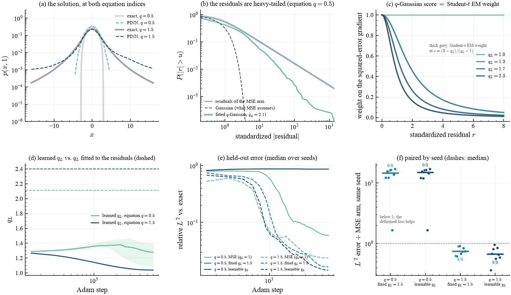

# Heavy-tailed PINN residuals

> A 2026 ICML paper shows that physics-informed network residuals are heavy-tailed
> and fixes it with a Student-t likelihood. That is a Tsallis method with the name
> removed — and reading it as one reproduces the benefit in one line, then finds
> the regime where it inverts.

## What it shows

Physics-informed neural networks minimize a PDE residual, and standard practice
minimizes its *mean square*. Abijuru et al. (ICML 2026) point out what that
silently assumes — "independent Gaussian residuals with a fixed global variance" —
and show that PINN residuals are instead "heterogeneous and heavy-tailed", so that
"a small number of large residuals can disproportionately dominate both the loss
and gradient". Their remedy is a **Student-t residual model**, fitted by an
expectation–maximization loop.

**The Student-t is the $q$-Gaussian**, and the correspondence is exact at qjax's
own relation $\nu = (3-q)/(q-1)$ — the one already used by `qjax.sample` to draw
$q$-Gaussian variates. Their EM weight

$$w(r) = \frac{\nu+1}{\nu + r^2/s^2}$$

is, term for term, the score of `qjax.q_gaussian_logpdf` divided by the gradient
of a squared residual:

$$\frac{\mathrm d}{\mathrm dr}\big[-\log \mathcal G_{q_L}(r)\big]
= w(r)\,\frac{\mathrm d}{\mathrm dr}\big[\beta r^2\big],
\qquad w(r) = \frac{1}{1 + (q_L-1)\beta r^2}.$$

The two agree to $\sim10^{-15}$, which the test suite pins, and at $q_L = 1$ the
weight is identically one — so **the mean-squared residual is the
Boltzmann–Gibbs member of the family**, not a separate baseline.

What qjax adds is that the entropic index need not be estimated by EM at all. The
EM alternation exists because the tail index is a latent variable; in qjax $q$ is
an ordinary differentiable argument, so one `jax.grad` trains the network *and*
its own residual model together.

Two entropic indices appear and they are unrelated, so they are named apart: $q$
is the **equation's** index, fixed by the physics
($\partial_t p = D\,\partial_{xx}p^{2-q}$), and $q_L$ is the **residual model's**,
learned.

## Result, in three parts

### 1. The premise holds — by more than the original paper claims

Collecting the residuals of a mean-squared-trained PINN at **held-out**
collocation points and fitting a $q$-Gaussian by maximum likelihood:

| equation $q$ | $\hat q_L$ from residuals | $\sigma$ | from Gaussian | excess kurtosis | Student-t $\nu$ |
| --- | --- | --- | --- | --- | --- |
| 0.5 | **2.110** | 0.027 | 41σ | 83 | 0.80 |
| 1.5 | **2.401** | 0.017 | 85σ | 44 | 0.43 |

$\nu < 1$ means **fewer than one degree of freedom — heavier-tailed than a Cauchy
distribution**, so the residuals do not merely have a heavy tail, they have no
finite mean. Because this PDE has a closed-form solution
(`qjax.physics.nlfp_density`, whose own residual vanishes at $10^{-15}$), that is
measured against ground truth rather than against another approximation. (The
excess kurtosis is a witness of non-Gaussianity, not an estimate of anything: at
$\hat q_L > 5/3$ the population fourth moment is infinite, so the sample value
grows with the number of points.)

### 2. Where their assumptions hold, their remedy works — in one line

At $q = 1.5$, where the solution is smooth, every seed is improved by the
deformed likelihood:

| arm | median $L^2$ ÷ MSE arm, same seed | range | seeds favouring |
| --- | --- | --- | --- |
| fixed $q_L = 1.5$ | **0.75×** | [0.62, 0.91] | **8/8** |
| learnable $q_L$ | **0.67×** | [0.36, 0.96] | **8/8** |

The pairing is what makes this readable. The seed-to-seed spread of the
mean-squared arm ($L^2$ from 0.012 to 0.040) is larger than the gap between the
arms, so a plot of medians with a seed range hides the effect; every arm at a
given seed trains on the *same* collocation points, so the per-seed ratio is the
informative statistic. A sign test on 8/8 gives $p = 0.004$.

### 3. At a free boundary it is catastrophic, and the reason is instructive

At $q = 0.5$ — compact support, a moving front — the same loss is **fifteen times
worse**, at zero seeds out of eight:

| arm | median $L^2$ | ÷ MSE arm | seeds favouring |
| --- | --- | --- | --- |
| MSE ($q_L=1$) | **0.0596** | — | — |
| fixed $q_L = 1.5$ | 0.8911 | 14.7× | 0/8 |
| learnable $q_L$ | 0.8882 | 15.0× | 0/8 |

A robust loss is, by construction, a loss that **tolerates large residuals**. In a
*forward* PDE problem the residual is not a noise model: it is the only thing
propagating the initial condition into the interior. Downweighting it removes that
force, and the solution decays into the spurious family this equation carries —
*every* spatially uniform density solves $\partial_t p = D\,\partial_{xx}p^{2-q}$
exactly, a fact the test suite checks directly.

The mechanism, measured:

| arm | peak $p(\cdot,0)$ | mass at $t=1$ | RMS residual |
| --- | --- | --- | --- |
| $q=0.5$, MSE | 1.328 | 1.141 | 0.110 |
| $q=0.5$, fixed $q_L=1.5$ | 1.274 | **0.005** | **2.660** |
| $q=0.5$, learnable $q_L$ | 1.273 | **0.005** | **2.719** |
| exact | 1.326 | 1.000 | 0 |

All three arms fit the initial condition. The deformed arms then let the solution
**decay to nothing**, ending with residuals twenty-five times *larger* than the
mean-squared arm and a loss that does not mind.

So the useful distinction is not whether residuals are heavy-tailed — they are, in
both regimes — but **whether the tail is noise or signal**. At a free boundary it
is signal: the residual is large because the solution genuinely has a kink there,
and discounting it means declining to fit the only hard part of the domain.

### And: joint descent is not EM

The learned index settles at 1.28 and 1.04 while the index fitted to the residuals
says 2.11 and 2.40 — gaps of 30σ and 83σ. Alternating (fit the residual model to a
*fixed* network, then the network to a fixed model, as EM does) is not the same as
descending on both at once, because a network free to change its residuals can
move them to suit the index rather than the other way round.

Note that the learned-index arm is nonetheless the **best** arm at $q = 1.5$
(0.67×): mild robustness helps even when the index delivering it disagrees with
the residuals it was fitted to. Which is an argument both for the EM structure and
against reading much into a learned index — arrived at by removing the alternation.

## Result

<figure markdown>
  
  <figcaption markdown>
  (a) The solution at both equation indices. (b) The ICML claim, measured: the survival function $P(|r|>u)$ of the residuals against the Gaussian a mean-squared objective assumes, and against the fitted $q$-Gaussian. (c) **The correspondence**: the $q$-Gaussian score (coloured) and the Student-t EM weight at $\nu=(3-q_L)/(q_L-1)$ (thick grey) coincide; $q_L=1$ is flat at one, i.e. no reweighting. (d) The learned $q_L$ against the $q_L$ fitted to the residuals (dashed) — they do not meet. (e) Held-out error against the exact solution; the deformed arms at $q=0.5$ never descend. (f) The comparison paired by seed: every point is one seed's error divided by the mean-squared arm's error at that same seed, so below 1 means the deformed loss helped.
  </figcaption>
</figure>

## Validation

| quantity | measured | exact |
| --- | --- | --- |
| residual of the exact solution | $5.8\times10^{-15}$ | 0 |
| … relative to $\max|\partial_t p|$ | $1.3\times10^{-15}$ | 0 |
| $q$-Gaussian score vs. Student-t EM score | $1.8\times10^{-15}$ | 0 |
| weight at $q_L=1$ (no reweighting) | 1.000000 | 1 |

## How the comparison is kept fair

- **The baseline is a plain mean-squared residual**, not a Gaussian likelihood
  with a fitted variance. Those differ: a fitted scale grows as the residual
  shrinks, which silently re-weights the residual term against the initial and
  boundary terms during training. The baseline therefore holds its scale fixed,
  while the two deformed arms fit theirs by maximum likelihood, as the paper's EM
  does.
- **The loss weights are identical across arms** (100 on both the initial and the
  boundary term). A deformed arm that downweights its residual term is therefore
  also shifting the balance toward those two. That shift *is* the mechanism at the
  free boundary; a practitioner could compensate for it, and we did not, because
  compensating per arm would have measured the compensation.
- **Both boundaries are penalized separately**, not their sum: the natural
  one-liner lets an error at $+L$ cancel the opposite error at $-L$ for free.
- **The residual distribution is measured on held-out collocation points**, and
  each seed draws its own training set, shared across arms.
- At 6000 steps the mean-squared arms are still descending, so this is a
  comparison at equal budget rather than at convergence.

## Takeaways

- The Student-t residual model of a 2026 ICML paper is a $q$-Gaussian likelihood,
  exactly, at qjax's own $\nu = (3-q)/(q-1)$ — and the mean-squared residual is
  its $q_L\to1$ member, not a separate thing.
- PINN residuals really are heavy-tailed: $\hat q_L \approx 2.1$–2.4, i.e. $\nu<1$,
  heavier than Cauchy, measured against an exact solution.
- Where the solution is smooth, the deformation earns its keep — 0.67–0.75× the
  error at 8/8 seeds — and costs one argument, because `q_gaussian_logpdf` is
  differentiable in its index.
- At a free boundary the same deformation is 15× worse, because robustness means
  tolerating large residuals and in a forward problem the residual is the only
  thing carrying the solution forward. Heavy tails alone do not license a robust
  loss; the question is whether the tail is noise or signal.
- Because the index is differentiable, the EM loop is unnecessary — but removing
  it is not free: the resulting learned index disagrees with the fitted one by
  tens of standard errors, even in the arm that wins.
- As with the [$q\leftrightarrow2-q$ duality](../theory.md#the-q-leftrightarrow-2-q-duality),
  the deformation has a *direction* and a domain of validity, and both are
  checkable in advance.

## References

- J. Abijuru, M. K. Nagda, J. Tauberschmidt, P. S. Ostheimer, S. Vollmer,
  S. Mandt, M. Kloft & S. Fellenz, *Heavy-tailed Physics-Informed Neural
  Networks*, ICML (2026).
- M. Raissi, P. Perdikaris & G. E. Karniadakis, *Physics-informed neural
  networks*, J. Comput. Phys. **378**, 686 (2019).
- C. Tsallis & D. J. Bukman, *Anomalous diffusion in the presence of external
  forces*, Phys. Rev. E **54**, R2197 (1996).
- A. R. Plastino & A. Plastino, Physica A **222**, 347 (1995).
- W. Thistleton, J. A. Marsh, K. Nelson & C. Tsallis, *Generalized Box–Müller
  method for generating q-Gaussian random deviates*, IEEE Trans. Inf. Theory
  **53**, 4805 (2007) — the $\nu \leftrightarrow q$ correspondence qjax uses.
