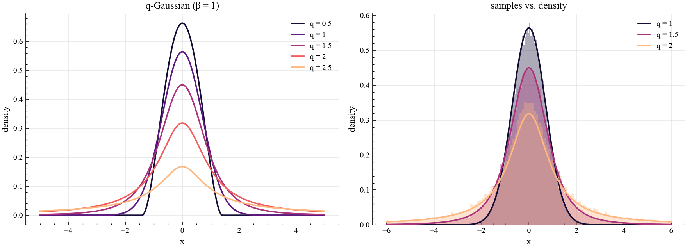

# The q-Gaussian family

> Visualize the `q`-Gaussian density across the entropic index and check that
> `qjax.sample` matches the analytic PDF.

## What it shows

The `q`-Gaussian is the maximum-Tsallis-entropy distribution under a fixed second
moment — the `q`-deformed analogue of the normal distribution. Written with the
deformed exponential $\exp_q(u) = [1 + (1-q)\,u]_+^{1/(1-q)}$, its density is

$$
\mathcal{G}_q(x) = \frac{\sqrt{\beta}}{C_q}\,\exp_q(-\beta x^2),
$$

where $\beta > 0$ sets the width and $C_q$ is the normalizing constant.

The single index `q` controls the tails. For $q < 1$ the support is *compact* —
the density is exactly zero beyond a finite range. At $q = 1$ it reduces to the
ordinary Gaussian $\sqrt{\beta/\pi}\,e^{-\beta x^2}$. For $1 < q < 3$ it develops
heavy, power-law tails: it is a rescaled Student-$t$ with $\nu = (3-q)/(q-1)$
degrees of freedom, whose variance is finite only for $q < 5/3$.

The example plots this density family for $q \in \{0.5, 1, 1.5, 2, 2.5\}$ and, on a
second panel, overlays histograms of sampled draws on the analytic density to
confirm the two agree.

## How it works

The density and the sampler are one call each; `beta` sets the width.

```python
import jax, jax.numpy as jnp
import qjax

x = jnp.linspace(-6.0, 6.0, 400)

# the density family across q (q = 1 is the standard Gaussian)
for q in (0.5, 1.0, 1.5, 2.0, 2.5):
    pdf = qjax.q_gaussian_pdf(x, q=q, beta=1.0)

# draw samples for 1 <= q < 3 and compare to the analytic density
samples = qjax.sample(jax.random.PRNGKey(0), q=1.5, beta=1.0, shape=(50_000,))
```

`qjax.plots.plot_q_gaussian` is a convenience helper that draws the left panel
directly.

## Result

<figure markdown>
  
  <figcaption markdown>
  Left: the `q`-Gaussian density for several values of `q` (heavier tails as `q` grows). Right: sampled histograms (`q = 1, 1.5, 2`) overlaid on the analytic density — they match.
  </figcaption>
</figure>

## Takeaways

A single parameter `q` interpolates continuously from compact-support through the
Gaussian to heavy-tailed distributions, so one family spans qualitatively
different regimes. The closed-form density `qjax.q_gaussian_pdf` and the
sampler `qjax.sample` are mutually consistent — the empirical histograms
track the analytic curve. This same distribution underpins the
[maximum-likelihood example](learnable_q.md), where `q` itself is recovered from
data.
