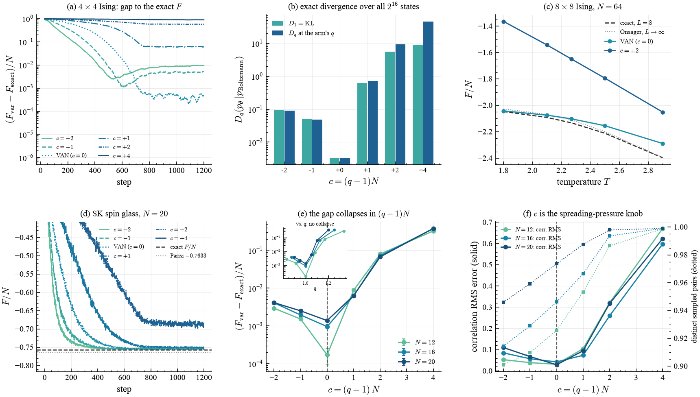
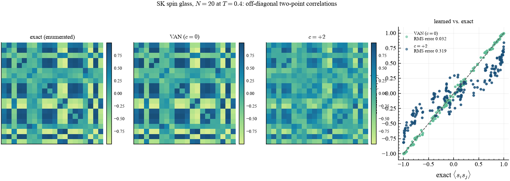

# Variational free energy at index $q$

> The nonextensive version of variational autoregressive networks. Boltzmann–Gibbs
> ($q=1$) is optimal — necessarily so — and what the deformation actually controls
> obeys a scaling law: everything depends on $q$ only through $(q-1)N$.

## What it shows

Variational autoregressive networks (Wu, Wang & Zhang, 2019) solve a
statistical-mechanics model by minimizing

$$F = \langle E\rangle_p - T\,S_1(p)$$

over an autoregressive neural network $p_\theta$, which can be both sampled and
evaluated exactly. The `q = 1` arm here *is* that method. Replacing the logarithm
by the $q$-logarithm gives the nonextensive objective:

$$F_q = \mathbb E_{s\sim p_\theta}\big[E(s) + T\ln_q p_\theta(s)\big].$$

### The duality, which is easy to get backwards

$F_q$ is **not** $\langle E\rangle - T S_q$. Summing the deformed logarithm
against $p$ rather than against the escort weight $p^q$ gives

$$-\mathbb E_p[\ln_q p] = \frac{1 - \sum_s p^{\,2-q}}{1-q} = S_{2-q}(p),$$

so the *thermodynamic* index is $2-q$. Consequently $q < 1$ supplies **less**
entropy pressure than Boltzmann–Gibbs, not more, and $q > 1$ supplies more. This
inverts the direction of every conclusion if taken the other way round, so it is
checked to machine precision in the test suite.

### The scaling law

$F_1$ is the only member of the family that is a variational *bound* on the
Boltzmann free energy, so $q = 1$ is necessarily the best approximation to it —
and the run confirms that at every size. What $q$ controls is how hard the
objective pushes the model to spread its mass, and the measurement is that the
free-energy gap, the correlation error and the sample diversity all depend on $q$
only through

$$c = (q-1)\,N.$$

At the uniform distribution $\sum_s p^{2-q} = M^{q-1} = e^{(q-1)N\ln 2}$, so the
entropy term is extensive only at $q = 1$ and the useful deformation shrinks like
$1/N$. Practically: an entropic index tuned on a small system does not transfer to
a large one at fixed $q$, only at fixed $(q-1)N$.

## How it works

The gradient comes from autodiff, never by hand. The REINFORCE estimator
$\mathbb E[(E + T\ln_q p + T p^{1-q})\nabla\log p]$ is what `jax.grad` produces
from this surrogate:

```python
import qjax
from qjax.nn import made_log_prob

def free_energy_surrogate(params, masks, spins, energies, temperature, q, baseline):
    log_p = made_log_prob(params, masks, spins)
    p = jnp.exp(log_p)
    weight = jax.lax.stop_gradient(
        energies + temperature * qjax.q_log(jax.lax.stop_gradient(p), q) - baseline
    )
    score = jnp.mean(weight * log_p)             # the reward-like part
    pathwise = temperature * jnp.mean(qjax.q_log(p, q))  # autodiff gives T E[p^{1-q} dlog p]
    return score + pathwise
```

At $q = 1$ this reduces to the published estimator exactly: $\ln_1 p = \log p$,
$p^0 = 1$, and the constant $+T$ is annihilated by $\mathbb E[\nabla\log p] = 0$.
The tests pin the autodiff gradient against the hand-derived form at
$q = 0.6,\,1.0,\,1.4$, and pin the $q\to1$ difference from plain VAN to exactly
$T\,\nabla\mathbb E[\log p]$.

$q$ is deliberately **not** learnable here — unlike in the other examples. That
is not an omission: minimizing $F_q$ over $q$ is meaningless, since the objective
would simply run to whichever $q$ makes the entropy term largest.

## Result

<figure markdown>
  
  <figcaption markdown>
  (a) $4\times4$ Ising: gap to the exact free energy per spin (the trace is a single-batch estimate, so it is shown as a moving average). (b) The divergence $D_q(p_\theta\Vert p_{\rm Boltzmann})$ evaluated **exactly** over all $2^{16}$ states — not an estimate, because the model is enumerable at $N=16$. (c) $8\times8$ Ising against the exact finite-lattice transfer matrix, with Onsager's thermodynamic limit for scale. (d) The Sherrington–Kirkpatrick trace against the exactly enumerated $F/N$ and Parisi's $-0.7633$. (e) **The scaling law**: gaps for $N = 12, 16, 20$ collapse onto one function of $c = (q-1)N$; the inset shows they do not collapse against $q$. (f) The mechanism — $c$ sets both the correlation error and how many distinct states the model samples.
  </figcaption>
</figure>

<figure markdown>
  
  <figcaption markdown>
  Off-diagonal $\langle s_i s_j\rangle$ for the SK spin glass: exactly enumerated, learned at $c=0$, and learned at $c=+2$, with the learned-vs-exact scatter. A low free energy alone does not certify a model — the correlations do.
  </figcaption>
</figure>

## Validation

Laptop tier, against exact values:

| quantity | measured | exact | source of the exact value |
| --- | --- | --- | --- |
| $4\times4$: the two exact codes differ by | $<10^{-6}$ | 0 | $2^{16}$ enumeration vs. transfer matrix |
| $4\times4$ model normalization $\sum_s p_\theta(s)$ | 1.000000 | 1 | MADE is exactly normalized |
| $4\times4$ $(F_{\rm var}-F_{\rm exact})/N$ at $c=0$ | +0.00051 | 0 | exhaustive enumeration |
| SK $N=20$ $(F_{\rm var}-F_{\rm exact})/N$ at $c=0$ | +0.00138 | 0 | $2^{20}$ enumeration |
| SK $N=20$ ground-state energy per spin | −0.7047 | −0.7633 | Parisi; the gap is finite-size |
| the $q=1$ bound $F_{\rm var}\ge F_{\rm exact}$ | holds in every arm | — | variational principle |

The variational free energy is accurate to $5\times10^{-4}$ per spin on the
enumerable lattice and $1.4\times10^{-3}$ per spin on the spin glass.

### The collapse, in numbers

$(F_{\rm var} - F_{\rm exact})/N$ at matched $c = (q-1)N$:

| $c$ | $N=12$ | $N=16$ | $N=20$ |
| --- | --- | --- | --- |
| −2 | 0.00293 | 0.00408 | 0.00412 |
| −1 | 0.00152 | 0.00195 | 0.00250 |
| **0** | **0.00017** | **0.00096** | **0.00138** |
| +1 | 0.00883 | 0.00630 | 0.00636 |
| +2 | 0.08004 | 0.07229 | 0.06729 |
| +4 | 0.32574 | 0.37519 | 0.38069 |

Where the deformation dominates ($|c| \ge 2$) the three sizes agree to within
about 10 % at matched $c$, spanning values that differ by a factor of 200 across
the table. Against $q$ itself there is no such collapse — the same $q = 1.1$ is
$c = 1.2$ at $N=12$ and $c = 2.0$ at $N=20$.

## Takeaways

- $\mathbb E_p[\ln_q p]$ gives $S_{2-q}$, not $S_q$; the deformation acts through
  the dual index.
- $q = 1$ minimizes the gap to the Boltzmann free energy, and must, because it is
  the only bound. Reporting that plainly is the point of having exact references.
- The entropic index is not extensive: its effect is governed by $(q-1)N$, so it
  does not transfer across system sizes at fixed $q$.
- `qjax.q_log` supplies the whole deformed gradient through autodiff, including at
  $q = 1$, so the nonextensive objective is a one-line change to the published
  method.

## References

- D. Wu, L. Wang & P. Zhang, *Solving statistical mechanics using variational
  autoregressive networks*, Phys. Rev. Lett. **122**, 080602 (2019).
- M. Germain, K. Gregor, I. Murray & H. Larochelle, *MADE: masked autoencoder for
  distribution estimation*, ICML (2015).
- L. Onsager, Phys. Rev. **65**, 117 (1944).
- D. Sherrington & S. Kirkpatrick, Phys. Rev. Lett. **35**, 1792 (1975).
- G. Parisi, *A sequence of approximated solutions to the S-K model for spin
  glasses*, J. Phys. A **13**, L115 (1980).
