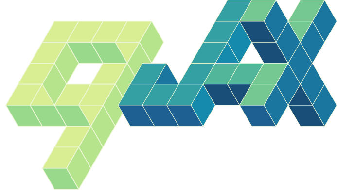
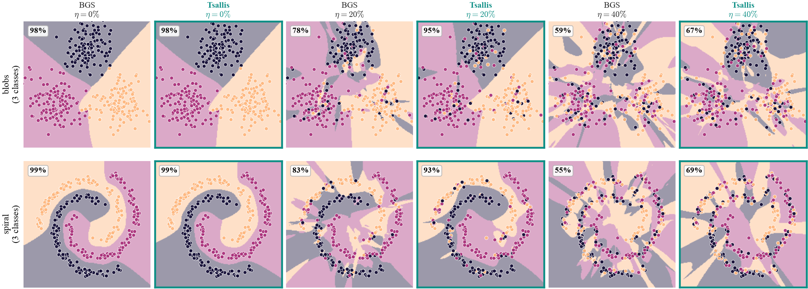

<!-- =================================================================
     HOME PAGE
     The hero below is plain HTML + the `.site-*` classes defined in
     docs/stylesheets/extra.css. Badges live in the README, where they
     answer a stranger's first questions; here they would only compete
     with the tagline.
     ================================================================= -->

<div class="site-hero" markdown>



<!-- The wordmark above already carries the name, so the required <h1> is
     visually hidden. It still has to exist: Material injects an `<h1>` with
     the nav title ("Home") into any page whose content has none. -->
<h1 class="site-hero__title site-hero__title--hidden">qjax</h1>

<p class="site-hero__tagline">
Tsallis statistics for artificial intelligence, built on
<a href="https://github.com/jax-ml/jax">JAX</a> — <em>q</em>-deformed entropies,
distributions and activations as pure, differentiable functions, with an
entropic index you can learn by gradient descent.
</p>

[Get started](installation.md){ .md-button .md-button--primary }
[View on GitHub](https://github.com/Kleyt0n/qjax){ .md-button }

</div>

## Why qjax

Tsallis (non-extensive) statistics generalizes Boltzmann–Gibbs–Shannon
statistics through a single *entropic index* $q$. As $q \to 1$ every construction
collapses back to its classical counterpart — Shannon entropy, the Gaussian,
softmax, the Kullback–Leibler divergence — while $q \neq 1$ opens up heavy tails,
sparse attention, and tunable exploration.

`qjax` exposes these $q$-deformed primitives as **pure, differentiable,
`jit`/`vmap`-friendly** JAX functions. Because $q$ is just another argument, you
can hold it fixed *or* **learn it end-to-end by gradient descent**.

```python
import jax, jax.numpy as jnp
import qjax

qjax.q_log(2.0, q=1.5)                                  # q-logarithm (-> log as q -> 1)
qjax.tsallis_entropy(jnp.array([.5, .3, .2]), q=2.0)    # -> Shannon as q -> 1
qjax.tsallis_entmax(jnp.array([2., 1., -1.]), q=2.0)    # sparsemax (sparse softmax)

# q is differentiable — learn it end to end:
jax.grad(lambda q: qjax.q_gaussian_logpdf(0.5, q, 1.0))(1.5)
```

## What is inside

<div class="site-grid" markdown>

<div class="site-card" markdown>
### [Installation](installation.md)
Install with uv or pip, the optional extras, and the GPU/TPU note.
</div>

<div class="site-card" markdown>
### [Quickstart](quickstart.md)
Every primitive in one runnable page, from `q_log` to a learnable `q`.
</div>

<div class="site-card" markdown>
### [Theory](theory.md)
The definitions `qjax` implements and their $q \to 1$ limits.
</div>

<div class="site-card" markdown>
### [Examples](examples.md)
Eight runnable scripts — five of them learn `q` by gradient descent.
</div>

<div class="site-card" markdown>
### [API reference](api.md)
Generated from source docstrings, so it always matches the installed version.
</div>

<div class="site-card" markdown>
### [Plots](api.md#plots)
A brand-ramp Matplotlib style and helpers that export vector PDFs.
</div>

</div>

## Primitives and their q → 1 limits

Every primitive is defined by a single closed form in the entropic index $q$,
and each recovers its Boltzmann–Gibbs–Shannon counterpart in the limit
$q \to 1$.

| `qjax` | Definition | Limit $q \to 1$ |
| --- | --- | --- |
| `q_log` | $\ln_q x = \dfrac{x^{1-q} - 1}{1 - q}$ | $\ln x$ |
| `q_exp` | $\exp_q x = \big[1 + (1-q)\,x\big]_+^{\frac{1}{1-q}}$ | $e^{x}$ |
| `tsallis_entropy` | $S_q(p) = \dfrac{1 - \sum_i p_i^{\,q}}{q - 1}$ | $-\sum_i p_i \ln p_i$ |
| `tsallis_cross_entropy` | $H_q(y, p) = -\sum_i y_i \ln_q p_i$ | $-\sum_i y_i \ln p_i$ |
| `tsallis_divergence` | $D_q(p \,\Vert\, r) = \dfrac{\sum_i p_i^{\,q}\, r_i^{\,1-q} - 1}{q - 1}$ | $\mathrm{KL}(p \,\Vert\, r)$ |
| `q_gaussian_pdf` | $\mathcal{G}_q(x) = \dfrac{\sqrt{\beta}}{C_q}\,\exp_q(-\beta x^2)$ | $\sqrt{\tfrac{\beta}{\pi}}\,e^{-\beta x^2}$ |
| `tsallis_entmax` | $\operatorname{entmax}_q(z) = \displaystyle\arg\max_{p \in \Delta}\,\langle p, z\rangle + S_q(p)$ | $\operatorname{softmax}(z)$ |

Here $[\,\cdot\,]_+ = \max(\cdot, 0)$ is the Tsallis cut-off, $C_q$ the
$q$-Gaussian normalization, and $\Delta$ the probability simplex. At $q = 2$,
`tsallis_entmax` is exactly **sparsemax**.

## Highlights

- **Differentiable in $q$.** The entropic index is finite everywhere, including
  the $q = 1$ limit, so `jax.grad` flows through it — $q$ can be *learned*.
- **JAX-native.** Pure functions, composable with `jax.jit`, `jax.vmap`, and
  `jax.grad`.
- **Tested at the limit.** The suite verifies the $q \to 1$ recovery, gradients,
  and `jit`/`vmap` behaviour of every primitive.
- **Publication-grade plots.** A brand-ramp Matplotlib style and helpers that
  export vector PDFs.

!!! note "Research library"
    `qjax` is a research project. The numerics are well tested, but the API may
    still evolve between releases.

## Example: label-noise robustness

When training labels are noisy, ordinary softmax **cross-entropy** is unbounded —
a confidently mislabeled example incurs an arbitrarily large loss, so an
over-parameterized network ends up *memorizing* the noise. Replacing the
logarithm with the deformed $q$-logarithm gives the **Tsallis cross-entropy**,
which is *bounded* for $q < 1$: its gradient saturates on unfittable points, so
the model ignores label noise instead of fitting it.

For a one-hot target with true class $c$ and softmax probabilities $p$,

$$
\mathcal{L}_q(p, c) = -\ln_q p_c = \frac{1 - p_c^{\,1-q}}{1 - q},
\qquad \ln_q x = \frac{x^{1-q} - 1}{1 - q}.
$$

As $q \to 1$ this is exactly the standard cross-entropy $-\log p_c$; for $q < 1$
the per-example loss is bounded above by $1/(1-q)$, so mislabeled points cannot
dominate the gradient.

The figure trains a small 3-class classifier on two shapes (blobs, spiral) from
clean data up to 40% label noise, comparing the Boltzmann–Gibbs–Shannon baseline
($q = 1$) with Tsallis ($q = 0.3$). The comparison is **fair** — both share the
same initialization, data, noisy labels and optimizer; only $q$ differs. Without
noise the two match (≈98–99%); as noise grows the baseline carves spurious
wrong-class islands while Tsallis keeps clean regions and higher accuracy.

<figure markdown>
  
  <figcaption markdown>
  Decision regions at 0%, 20% and 40% label noise; the **Tsallis** (robust)
  columns are framed in teal. See the
  [classification example](examples/classification.md) for the full setup.
  </figcaption>
</figure>

## What's inside the package

| Module | Contents |
| --- | --- |
| [`qjax.core.functions`](api.md#core-deformed-functions) | `q_log`, `q_exp`, and the $q$-algebra (`q_add`, `q_diff`, `q_prod`, `q_div`) |
| [`qjax.core.entropy`](api.md#core-entropy-and-divergences) | `tsallis_entropy`, `tsallis_cross_entropy`, `tsallis_divergence` |
| [`qjax.core.distributions`](api.md#core-the-q-gaussian-distribution) | the $q$-Gaussian: `q_gaussian_pdf`, `q_gaussian_logpdf`, `sample`, `normalization` |
| [`qjax.core.activations`](api.md#core-activations-entmax) | `tsallis_entmax` (the $q$-deformed softmax / sparsemax family) |
| [`qjax.plots`](api.md#plots) | brand-ramp, publication-grade plotting helpers |

## Next steps

- **Get started** — [Installation](installation.md) and [Quickstart](quickstart.md).
- **Understand the math** — [Theory](theory.md).
- **See it in action** — [Examples](examples.md).
- **Look up a function** — [API reference](api.md).
